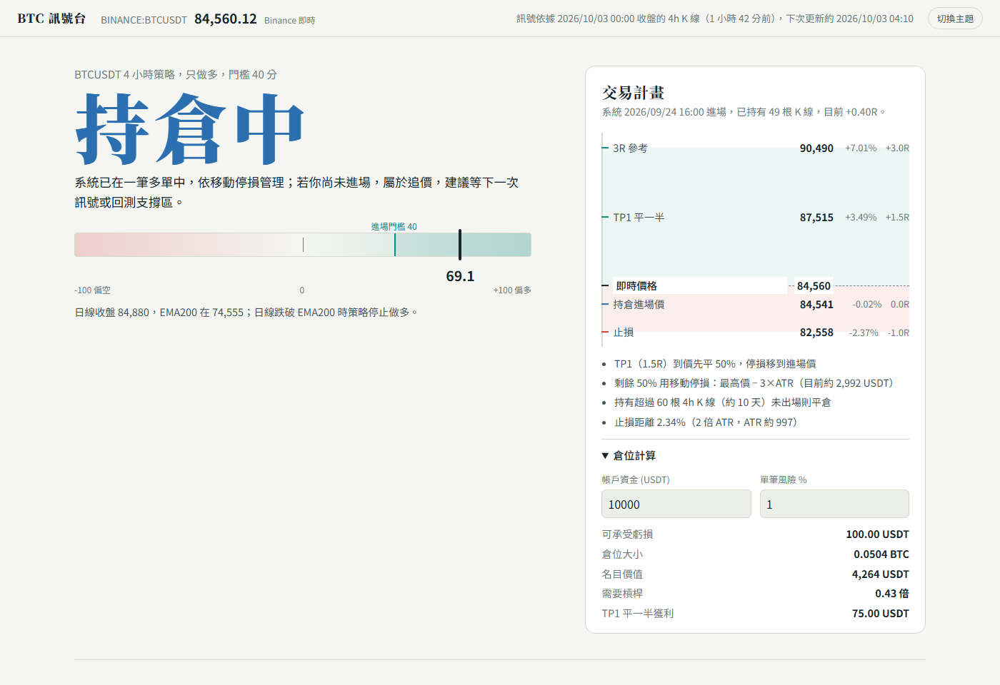

# BTC-Trading

BTCUSDT 4 小時的多因子 + SMC（Smart Money Concepts）共振訊號，加上一個 HTML 儀表板：現在該不該進場、止損止盈放哪裡，以及支持這套規則的回測證據。



## 怎麼用

儀表板：`docs/index.html`。直接用瀏覽器打開即可（資料在 `docs/data/latest.js`），或部署到 GitHub Pages（見下方）。

在本機更新資料：

```bash
pip install -r requirements.txt
python scripts/update.py      # 抓最新 K 線、計算訊號與回測，寫入 docs/data/
python scripts/research.py    # 重跑參數研究與過度擬合檢驗（約 2 分鐘），會改寫 config/strategy.json
python scripts/ltf_research.py  # 1h 進場方式研究（約 1 分鐘）
python scripts/flow_research.py # Coinbase 溢價與資金費率研究（首次下載 Coinbase 資料約 2 分鐘）
python scripts/oi_research.py   # 爆倉／槓桿擠壓研究（首次下載未平倉量資料約 1 分鐘）
python -m pytest -q tests     # 測試（含「不偷看未來資料」檢查）
python -m btc_signal.notify "測試"  # 選用：測試 Telegram / Discord 推播設定
```

## 策略

每根 4h K 線收盤後，把 7 個因子各縮放到 -1～+1，加權後得到 -100～+100 的分數：

| 因子 | 權重 | 內容 |
|---|---|---|
| 日線趨勢 | 25 | 日線收盤 vs EMA200、EMA50 vs EMA200 |
| SMC 市場結構 | 20 | 最近一次 BOS / CHoCH 的方向（swing 長度 5） |
| 主週期趨勢 | 15 | 4h EMA21 / EMA55 與價格位置 |
| 動能 | 10 | RSI 與 MACD 柱狀體，RSI 超過 75 時打折 |
| 溢價／折價 + OB/FVG | 10 | 價格在波段區間的位置、是否在多方 Order Block / FVG 內 |
| 趨勢強度 | 10 | ADX 與 ±DI |
| 恐懼貪婪（反向） | 10 | 貪婪扣分、恐懼加分 |

- **進場**：分數 ≥ 40，而且日線在 EMA200 之上；下一根 K 線開盤做多。只做多。
- **止損**：進場價 − 2×ATR。
- **出場**：1.5R 先平一半並把止損移到進場價，剩下一半用「最高價 − 3×ATR」的移動停損；60 根 K 線（約 10 天）後平倉。
- **冷卻**：出場後 3 根 K 線內不重新進場。剛出場時即使分數達標，儀表板會顯示「冷卻中」，與回測行為一致。

SMC 偵測（`btc_signal/smc.py`）用 TradingView MCP 對照過 LuxAlgo「Smart Money Concepts」：在 BINANCE:BTCUSDT 4h 上，目前有效的 Order Block 與最近的 BOS/CHoCH 價位完全一致。K 線資料也與 TradingView 的同一商品逐根核對過。

## 研究結果

864 組參數（週期 1h/4h、swing 長度、權重、門檻、多空、出場方式、止損方式）只用 2019–2023 挑選，2024 年之後當樣本外測試。每筆風險 1%，含 0.05% 手續費與 0.02% 滑價。

1% 是保守的示範值，不是最佳化的結果。Sharpe 不隨風險改變，所以沒有「最佳」的風險，只有你能承受多深的回撤。理論上讓長期複利最快的 Kelly 比例約為每筆 22%，但它假設回測的勝率和賠率完全準確，實務上常用 1/4 到 1/2 Kelly 以下。各風險下的報酬、回撤與蒙地卡羅最差情況，見儀表板的「公平比較」。

| | 樣本內 2019–2023 | 樣本外 2024–2026/10 | 買入持有（樣本外） |
|---|---|---|---|
| 年化報酬 | 10.4% | 12.0% | 28.8% |
| 最大回撤 | -7.5% | -6.9% | -53.0% |
| Sharpe | 1.46 | 1.50 | 0.77 |
| 勝率 / 獲利因子 | 51.7% / 1.97 | 52.6% / 1.94 | |

- 樣本內前 20 名在樣本外 100% 仍獲利，樣本外 Sharpe 中位數 1.27，代表不是單一參數碰巧。
- 4h 明顯優於 1h（中位 Sharpe 0.83 vs 0.08）。用 1h 找進場點也沒有幫助，見下方。
- 分數高不代表結果更好：40–50 分進場平均 +0.58R，70 分以上 +0.39R。
- 弱點：只做多，牛市大幅落後買入持有（2020 年 +26% vs +299%）；優勢是避開熊市（2022 年 0% vs -65%）。

### 公平比較：同樣的風險，誰賺得多

策略平均只用 0.39 倍部位、大部分時間空手，買入持有則是 100% 一直在場。直接比報酬會低估策略，只看 Sharpe 又會高估它，所以儀表板的「公平比較」把兩者放在同樣的風險下比較，並可切換起點（全期間／樣本外 2024 起／2025 起）。槓桿版本以永續合約執行，扣除實際歷史資金費率（2019 年以來平均每年約 11.5% 的名目部位）。

樣本外 2024-01 起：

| | 年化 | 最大回撤 | 平均／最高槓桿 |
|---|---|---|---|
| 策略 風險 1%（現貨可做，不付資金費率） | 12.0% | -6.9% | 0.39× / 0.82× |
| 策略 風險 3% | 33.9% | -19.6% | 1.16× / 2.45× |
| 策略 風險 5% | 57.4% | -31.4% | 1.94× / 4.09× |
| 買入持有 0.5× | 16.6% | -30.0% | |
| 買入持有 1× | 28.7% | -53.0% | |
| 買入持有 2×（每日調整、付資金費率） | 15.4% | -82.1% | |
| 每月定期定額 | IRR 9.4% | 市值 -42.0% | |

- 回撤同為 -30% 時，策略（風險約 4.8%）年化 54.5%，買入持有 0.5× 只有 16.6%。不過那個風險值是事後挑來剛好打平回撤的，同樣設定的蒙地卡羅最差 5% 回撤是 -45%。
- 買入持有加槓桿會被波動吃掉：2× 的報酬比 1× 還低，回撤卻深得多；從 2019 年起算 3× 會爆倉。策略有止損又常空手，報酬和回撤大致隨風險等比例放大。
- 定期定額不比較公平：它是分批投入的現貨流，報酬以 IRR 計算，和一次投入的年化不能直接比。這段期間 BTC 先漲後跌，定期定額反而比一次投入差，放進比較只會讓策略看起來更好，所以只列為參考。

### 用 1 小時線找進場點有沒有用？

常見做法是大週期定方向、小週期找進場：等價格回檔到 OB/FVG，或等 1h 出現 CHoCH/BOS 再進，止損放在 1h 波段低點，好處是止損更近。`scripts/ltf_research.py` 把 4h 訊號放到 1h K 線上執行（`btc_signal/ltf.py`，進場後的管理與原策略相同），測了 36 種變化：

| 進場方式 | 最佳設定 | 樣本內 Sharpe | 樣本外 Sharpe | 同類中位數（內／外） |
|---|---|---|---|---|
| 下一根開盤直接進（目前） | — | 1.22 | 1.56 | — |
| 掛單等回檔 | 收盤價 −0.25 ATR，8 小時 | 1.19 | 1.15 | 0.86 / 0.65 |
| 等 1h 結構突破 | swing 5，8 小時，1h 止損 | 1.12 | 0.67 | 0.66 / 0.68 |

36 種變化沒有任何一種在樣本內或樣本外贏過直接進場。原因是逆向選擇：直接進場的交易中，8 小時內曾回檔 0.5 ATR（掛單會成交）的只有 51%，平均 +0.13R；從不回頭的那些平均 +0.66R，貢獻總獲利的 83%。掛在 1 ATR 下方的單只會買到虧損的交易（平均 −0.35R）。趨勢跟隨的獲利來自少數不回頭的大波段，追求更好的進場價反而會錯過它們；1h 止損更近，也更容易被雜訊掃掉。完整結果：[reports/ltf_research.md](reports/ltf_research.md)。

### 看資金流向（法人動向）有沒有用？

ETF 淨流入只有 2024 年以後的資料，而且全部落在樣本外；CME 的 COT 每週公布一次，槓桿基金的空單大多是「買 ETF、空期貨」的套利，不代表看空。這兩種都無法用同樣的方法驗證。`scripts/flow_research.py` 改測能回溯到 2019 年的兩種，各當成進場過濾或第 8 個因子，共 33 種設定：

- **Coinbase 溢價**：Coinbase BTC-USD 對 Binance BTC-USDT 的價差，代表美國現貨買盤（`btc_signal/flows.py`）。
- **永續資金費率**：槓桿多單的擁擠程度。

| 方式 | 樣本內最好的設定 | 樣本內 Sharpe | 樣本外 Sharpe |
|---|---|---|---|
| 目前策略 | — | 1.46 | 1.50 |
| Coinbase 溢價過濾 | 24h 均值 > -0.10% 才進場 | 1.33 | 1.48 |
| Coinbase 溢價因子 | 24h 均值，權重 15 | 1.31 | 0.89 |
| 資金費率擁擠過濾 | 近 21 期均值 < 0.03% 才進場 | 1.53 | 1.48 |
| 資金費率反向因子 | 近 21 期，權重 5 | 1.38 | 1.09 |

沒有任何設定在樣本內和樣本外都勝過目前策略。最接近的是資金費率擁擠過濾，它在樣本內有幫助，靠的是避開 2020–2021 年資金費率過熱時的進場（2021 年有 34% 的時間近 21 期均值 ≥ 0.03%）。但 2022 年以後資金費率很少這麼高（2024 年 7%，之後 0%），樣本外它只擋掉 3 筆，結果略差。門檻之間也不一致（0.03% 有幫助、0.05% 反而變差），算進試驗次數後 Deflated Sharpe 只有 74%。Coinbase 溢價則兩種用法都沒有幫助：溢價為正、資金費率高，常常正是趨勢最強、這套策略最賺錢的時候，擋掉反而少賺。結論是不加入策略。完整結果：[reports/flow_research.md](reports/flow_research.md)。

### 看爆倉／槓桿擠壓有沒有用？

爆倉熱力圖（Coinglass 等）是用未平倉量加上假設的槓桿分布估算出來的，誤差常有 1–3%，而且歷史資料要付費，無法驗證。`scripts/oi_research.py` 改用 Binance 公開的 5 分鐘未平倉量（2020-09 起，`btc_signal/positioning.py`）：「價格急跌且 OI 大降」代表多單被爆倉洗掉，「價格上漲且 OI 暴增」代表槓桿擁擠。事件門檻只用樣本內的分位數決定。樣本內只能從 2020-09 到 2023（目前策略同期 Sharpe 1.19），2024 以後為樣本外。

- **事件本身**：日線多頭中，「4 小時內跌 ≥ 1.5 ATR 且 OI 跌幅前 5%」之後 24 小時平均漲 +1.12%（樣本內，18 次），一般多頭時段只有 +0.26%；樣本外是 +0.60% 對 +0.11%（14 次）。方向一致，但 t 值只有 1.07 和 0.55，無法和運氣區分。
- **放進策略**：18 種設定（洗盤後也進場、槓桿擁擠時不進場）有 3 種在樣本內外都略勝，差距都只在幾筆交易之內。照規則用樣本內挑出的最好設定，樣本外 Sharpe 1.37，比目前的 1.51 差；Deflated Sharpe 62%。

結論：現象可能存在，但事件太少、證據不足，不加入策略；資料累積更多年後可以再檢查。完整結果：[reports/oi_research.md](reports/oi_research.md)。

### 過度擬合檢驗

從 864 組裡挑最好的，本身就會讓回測看起來比實際好。`research.py` 另外做了三項檢驗：

| 檢驗 | 結果 | 解讀 |
|---|---|---|
| Deflated Sharpe（Bailey & López de Prado） | 77.6% | 864 組毫無真本事的參數，最好的一組樣本內 Sharpe 也預期有 1.14；採用的 1.46 勝過它的機率 77.6%，未達 95%。864 組高度相關，這是最嚴格的算法 |
| 樣本外 PSR | 99.5% | 參數在 2023 年底固定，之後真實 Sharpe > 0 的機率。這是比較乾淨的證據 |
| 蒙地卡羅（交易順序重抽 5,000 次） | 回撤中位 -7.9%，最差 5% 為 -13.3% | 實際逐筆回撤 -6.5%，屬於幸運的一邊；部位規模要用 -13% 左右來準備 |
| Walk-forward（2021 起每年只用過去資料重選參數） | 年化 6.8%、Sharpe 0.97、回撤 -10.3% | 挑參數的方法本身有效，但比固定參數的回測（Sharpe 1.11）差，這個落差才是對未來比較誠實的預期 |

Walk-forward 每年都選到「4h、swing 5、只做多、移動停損、ATR 止損」，只在權重與門檻（40/50）之間切換，參數結構穩定。

完整報告：[reports/research.md](reports/research.md)。

### 參數更新規則

實盤用的參數存在 `config/strategy.json`，GitHub Actions 只讀取它、不會自動重挑。規則事先寫好，不因為某段時間表現不好就臨時更改：

1. **評估的切點固定**：參數只用 2019–2023 挑選，2024 以後當樣本外。儀表板「公平比較」切換「2025 起」等起點時，用的也是同一組參數，只改變比較從哪天開始算。
2. **每年 1 月例行檢視一次**：執行 `python scripts/research.py`，看 walk-forward 表最後一列，也就是用到去年底的全部資料、以同一套規則重挑的結果。
3. **只有在以下兩點都成立時才更換**：新選出的設定在結構上不同（週期、只做多／多空、出場方式或止損方式改變，而不只是權重或門檻），而且 walk-forward 顯示「每年重挑」優於「固定參數」。目前兩者都不成立：每年重挑的 Sharpe 是 0.97，固定參數是 1.11。

為什麼不直接用全部資料重挑：資料越多估計越穩，這點沒錯。但 walk-forward 的結果顯示，每年重挑沒有比固定參數好；每年選出的結構也幾乎一樣，只在權重與門檻（40 或 50）之間換來換去，差別大多是雜訊。重挑反而會讓參數跟著最近的行情漂移。

歷次檢視紀錄（用 walk-forward 回推）：

| 檢視時間 | 使用資料 | 會選出的設定 | 結論 |
|---|---|---|---|
| 2025 年 1 月 | 2019–2024 | 4h、swing 5、不含位置、門檻 50、只做多、移動停損、ATR | 只差權重與門檻 → 不換 |
| 2026 年 1 月 | 2019–2025 | 與目前參數相同（含情緒、門檻 40） | 不需更換 |

下一次檢視：2027 年 1 月，使用 2019–2026 的資料。

## 資料與自動更新

| 資料 | 來源 | 備援 |
|---|---|---|
| K 線 1h / 4h / 1d | Binance 公開行情 `data-api.binance.vision` | OKX |
| 恐懼貪婪指數 | alternative.me | 缺資料時該因子為 0 |
| 資金費率（目前值） | Binance 永續 | OKX |
| 資金費率歷史（槓桿回測扣費用） | `data/funding_seed.csv` + Binance 增量 | OKX（近 3 個月） |
| 頁面即時價格 | 瀏覽器直接查 Binance / OKX，每 15 秒 | 顯示最新收盤 |

**為什麼不是每天一次**：訊號建立在 4h K 線上，一天只更新一次會讓進場晚最多 20 小時。因此 GitHub Actions 在每根 4h K 線收盤後 7 分鐘執行（UTC 0/4/8/12/16/20 點），每次約 1 分鐘，每月約 180 分鐘，公開 repo 免費。
- `api.binance.com` 會擋美國 IP（GitHub runner 在美國），所以用 `data-api.binance.vision`。
- K 線用 `actions/cache` 增量快取。
- 參數研究不會自動重跑，避免參數在沒人看的情況下漂移（見下方「參數更新規則」）。
- 公開 repo 若 60 天沒有任何 commit，GitHub 會自動停用排程，而訊號更新本身不會產生 commit。workflow 裡的 `keepalive` 會在最後一次 commit 超過 45 天時推一個空 commit，讓排程持續運作。
- 更新失敗時，網頁右上角會顯示「資料已過期」。GitHub 預設也會寄信通知 workflow 失敗（個人設定 → Notifications → Actions）。

**訊號紀錄**：每次更新會把當下發布的狀態寫進 `docs/data/history.json`，儀表板的「訊號紀錄」區塊顯示狀態變化與出場結果。這是上線後的真實前測紀錄，不是回測重算。GitHub runner 每次都是乾淨環境，所以腳本會先從已部署的網站（`SITE_URL`）和快取取回舊紀錄再合併。

**推播通知（選用）**：以下情況會發送通知，內容是儀表板上「現在要做的事」的同一份下單步驟（價位、數量公式、停損與 TP1 掛單、時間停損日期）：
- 出現進場訊號（例如「等待」→「進場做多」）
- 系統進場（→「持倉中」，附目前止損與 TP1）
- TP1 到價（提醒把止損移到保本）
- 出場（附結果與原因）

同一根 K 線重跑不會重複發送。設定方式：在 repo → Settings → Secrets and variables → Actions → New repository secret 新增下表任一組，填了哪組就用哪個管道：

| 管道 | Secret | 說明 |
|---|---|---|
| Email | `SMTP_USER`、`SMTP_PASSWORD`、`EMAIL_TO` | 見下方 Gmail 設定。`EMAIL_TO` 可填多個，用逗號分隔 |
| Email（非 Gmail） | 再加 `SMTP_HOST`、`SMTP_PORT` | 預設 `smtp.gmail.com`、`465`（SSL）；587 會用 STARTTLS |
| Telegram | `TELEGRAM_BOT_TOKEN`、`TELEGRAM_CHAT_ID` | 用 @BotFather 建立 bot，chat id 可從 `getUpdates` 取得 |
| Discord | `DISCORD_WEBHOOK_URL` | 頻道設定 → 整合 → Webhook |

**Gmail 設定**（建議另外開一個寄信專用的 Gmail）：
1. Google 帳戶 → 安全性 → 開啟「兩步驟驗證」。
2. 到 https://myaccount.google.com/apppasswords 建立一組「應用程式密碼」（16 個字元）。
3. GitHub Secrets 填入 `SMTP_USER`＝這個 Gmail 地址、`SMTP_PASSWORD`＝剛剛的應用程式密碼（不是 Gmail 登入密碼）、`EMAIL_TO`＝要收信的地址。
4. 到 Actions 手動執行一次 workflow 確認沒有錯誤。下一次狀態改變時就會收到信。

本機測試：設定同樣的環境變數後執行 `python -m btc_signal.notify "測試"`。沒設定就不發送，也不影響更新。

**時間差**：GitHub 的排程通常在 4h 收盤後 10–30 分鐘才執行，所以通知會比回測假設的「下一根開盤」晚一點。用 1h 資料估算，晚 1 小時進場平均只少約 0.03R（每筆平均獲利約 0.45R）。

**啟用 GitHub Pages**：repo → Settings → Pages → Source 選「GitHub Actions」，然後到 Actions 手動執行一次「Update signal & deploy dashboard」。私人 repo 使用 Pages 需要付費方案。

## 專案結構

```
btc_signal/   data.py 資料源、indicators.py 技術指標、smc.py 結構/OB/FVG、
              signals.py 評分與交易計畫、backtest.py 回測、
              stats.py PSR/DSR 與蒙地卡羅、compare.py 槓桿／等回撤／定期定額比較、
              ltf.py 在 1h K 線上執行 4h 訊號、flows.py Coinbase 溢價與資金費率特徵、positioning.py 未平倉量、history.py 訊號紀錄、notify.py 推播
data/         funding_seed.csv 資金費率歷史（cache/ 為本機快取，不進版控）
scripts/      update.py 產生儀表板資料、research.py 參數研究、ltf_research.py 1h 進場研究、
              flow_research.py 資金流向研究、oi_research.py 爆倉研究
config/       strategy.json 目前採用的參數（由 research.py 產生）
docs/         儀表板（GitHub Pages 根目錄），data/ 為產出的資料
tests/        合成資料測試，含 no-lookahead 檢查
```

## 免責聲明

這是研究用途的程式，不是投資建議。回測已盡量保守（下一根開盤進場、同根 K 線同時碰到止損與止盈視為先止損），但過去績效不代表未來。
